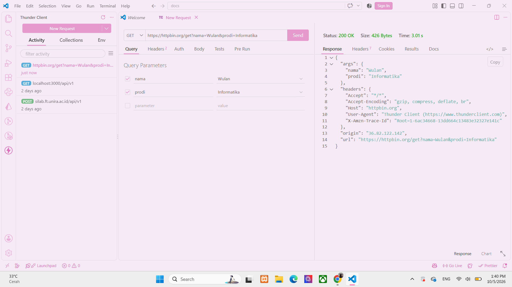
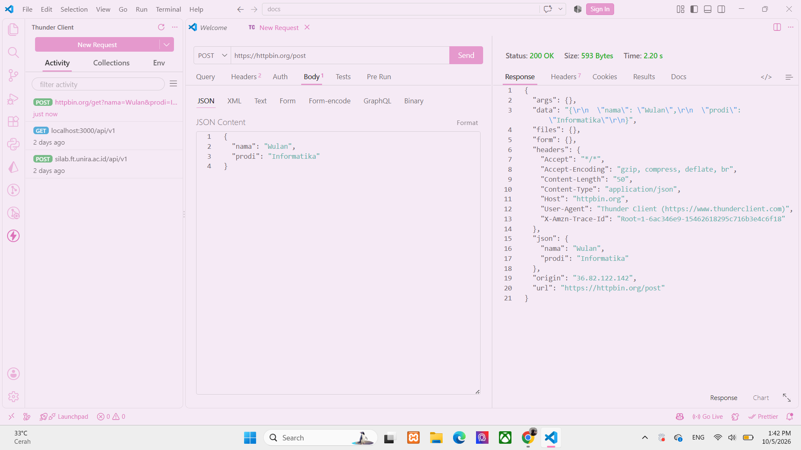

# Tugas Mandiri 1 — Mengenal HTTP Method dan Endpoint
### Tujuan :
Memahami penggunaan HTTP method dan endpoint serta mengetahui bagaimana client mengirim request dan menerima response dari server.

## 1. GET
URL: https://httpbin.org/get?nama=Wulan&prodi=Informatika
Status: 200 OK
Hasil: Server berhasil menerima request GET dan mengembalikan query parameter yang dikirim.

## 2. POST
URL: https://httpbin.org/post
Data:
{
  "nama": "Wulan",
  "prodi": "Informatika"
}
Status: 200 OK
Hasil: Server berhasil menerima data JSON.

## 3. PUT
URL: https://httpbin.org/put
Data:
{
  "nama": "Wulan",
  "prodi": "Informatika",
  "semester": 5
}
Status: 200 OK
Hasil: Data berhasil diterima

## 4. PATCH
URL: https://httpbin.org/patch
Data:
{
  "semester": 5
}
Status: 200 OK
Hasil: Data perubahan berhasil diterima

## 5. DELETE
URL: https://httpbin.org/delete
Status: 200 OK
Hasil: Request DELETE berhasil diterima

## Tabel HasiL Pengujian
|No.|Method|Endpoint|Data yang dikirim|Status|Hasil|
|---:|---|---|---|---:|---|
|1.|GET|'/get'|Query parameter|200|Data query berhasil diterima server|
|2.|POST|'/post'|JSON nama dan prodi|200|Data JSON berhasil diterima|
|3.|PUT|'/put'|JSON nama, prodi, semester|200|Data berhasil diterima|
|4.|PATCH|'/patch'|JSON semester|200|Data perubahan berhasil diterima|
|5.|DELETE|'/delete'|Tidak ada|200|Request DELETE berhasil diterima|

## Screenshot Pengujian
### GET 

### POST

