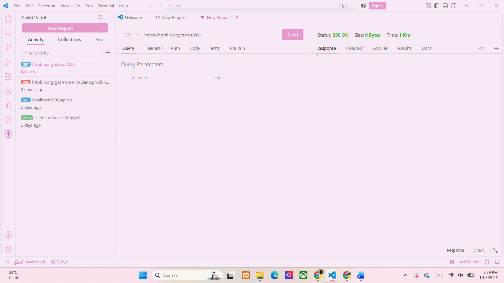
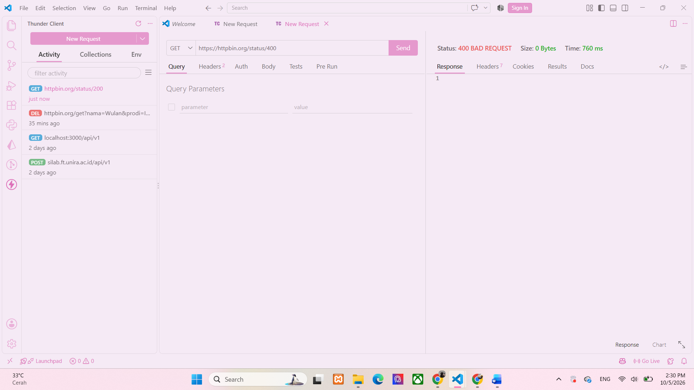

## Tugas Mandiri 2 - Memahami HTTP Status Code
### Tujuan :
Memahami arti dari berbagai HTTP status code dan mengetahui kondisi yang menyebabkan server memberikan status code tertentu.

1. Apa perbedaan 400 dan 404?
400 berarti request yang dikirim oleh client tidak valid atau salah. 
Sedangkan 404 berarti resource atau alamat yang diminta tidak ditemukan di server. 
Contohnya, kalau format request kita salah bisa mendapat 400, sedangkan kalau kita meminta halaman yang tidak ada bisa mendapat 404.

2. Apa perbedaan 401 dan 403?
401 biasanya berarti kita belum melakukan autentikasi atau belum memberikan kredensial yang diperlukan. 
Sedangkan 403 berarti server sudah memahami request tetapi kita tidak memiliki izin untuk mengaksesnya.
Gampangnya:
401 = belum punya/menunjukkan identitas
403 = sudah dikenali, tapi tidak boleh masuk

3. Mengapa 500 menunjukkan masalah pada sisi server?
Karena status 500 Internal Server Error menunjukkan bahwa server mengalami masalah ketika mencoba memproses request. 
Jadi masalah utamanya berasal dari proses atau kondisi di sisi server, bukan sekadar kesalahan request dari client.

4. Apakah semua error HTTP berarti server mengalami kerusakan?
Tidak. Tidak semua error HTTP berarti server rusak. Beberapa status error terjadi karena request dari client bermasalah, 
misalnya 400, atau karena resource tidak ditemukan seperti 404. Status 500 baru menunjukkan adanya masalah pada sisi server.

## Tabel Hasil Pengujian 
| Status Code | Arti | Hasil Pengujian | Kapan Digunakan |
|---|---|---|---|
| 200 | Berhasil | Request berhasil diproses oleh server | Saat request berhasil dan data dapat diberikan |
| 201 | Created | Request berhasil dan data/resource berhasil dibuat | Saat membuat data baru |
| 400 | Bad Request | Request yang dikirim tidak valid | Saat data/request dari client salah |
| 401 | Unauthorized | Client belum melakukan autentikasi yang diperlukan | Saat akses membutuhkan login/token tetapi belum diberikan |
| 403 | Forbidden | Server memahami request tetapi menolak akses | Saat user tidak memiliki izin mengakses resource |
| 404 | Not Found | Resource atau endpoint yang diminta tidak ditemukan | Saat URL/resource tidak tersedia |
| 500 | Internal Server Error | Terjadi kesalahan pada sisi server | Saat server mengalami error saat memproses request |

## Screenshot Pengujian 
### Status Code 200

### Status Code 201 

### Status Code 400

