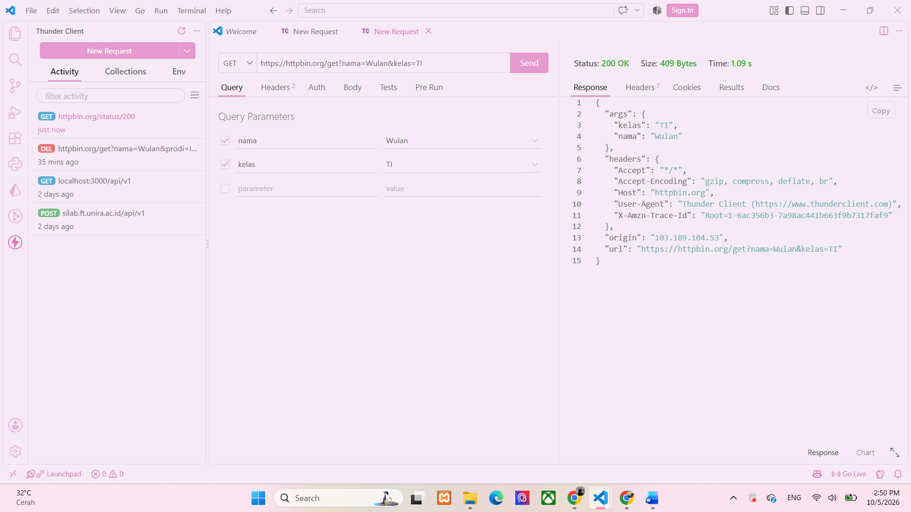
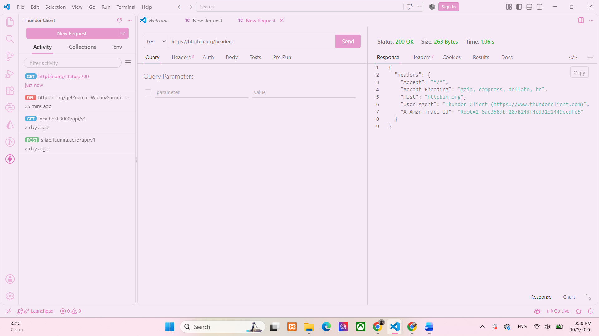

## Tugas Mandiri 3 -  Memahami Request dan Response
### Tujuan :
Memahami konsep request dan response serta mengetahui fungsi query parameter dan HTTP header dalam komunikasi antara client dan server.

1. Apa yang dimaksud request?
Request adalah permintaan yang dikirim oleh client kepada server untuk meminta atau mengirim suatu informasi. contohnya:
GET https://httpbin.org/get

2. Apa yang dimaksud response?
Response adalah balasan yang diberikan server setelah menerima dan memproses request dari client. contohnya HTTPBin mengembalikan:
200 OK
beserta data dalam bentuk JSON

3. Apa fungsi query parameter?
Query parameter digunakan untuk mengirim informasi tambahan melalui URL.contohnya:
https://httpbin.org/get?nama=Wulan&kelas=TI
disini:
nama=Wulan
kelas=TI
adalah query parameter

4. Apa fungsi HTTP header?
HTTP header digunakan untuk memberikan informasi tambahan tentang request atau response.
contoh header dapat berissi informasi seperti:
User-Agent
Accept
Content-Type
Header membantu server mengetahui informasi tentang request yang dikirim.

5. Apa perbedaan data pada URL dengan data pada request body?
Data pada URL biasanya dikirim melalui query parameter dan dapat terlihat langsung pada URL. 
contoh :
https://httpbin.org/get?nama=Wulan
Sedangkan request body berisi data yang dikirim di dalam isi request, bukan di URL. Biasanya digunakan saat mengirim data menggunakan POST, PUT, atau PATCH.
contoh body:
{
  "nama": "Wulan",
  "kelas": "TI"
}

## Screenshot Pengujian 
### GET 

### HEADER

