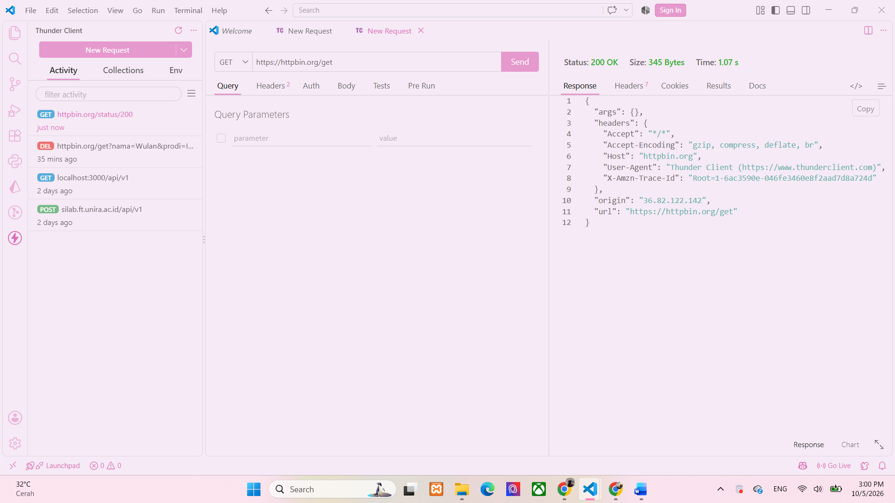
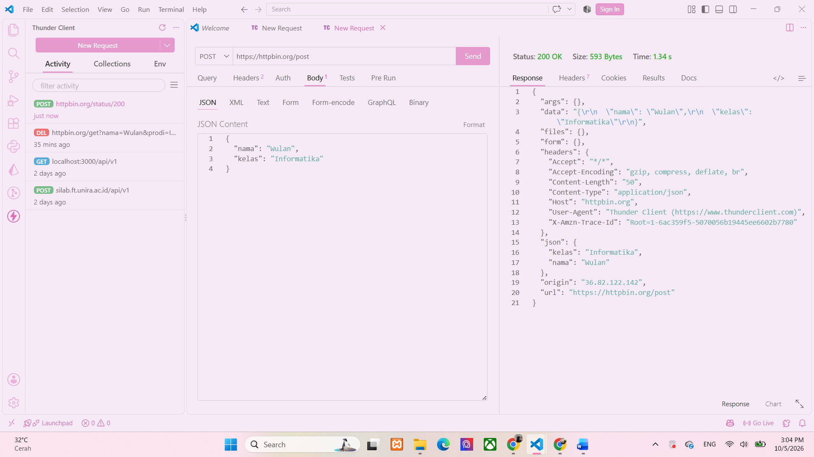
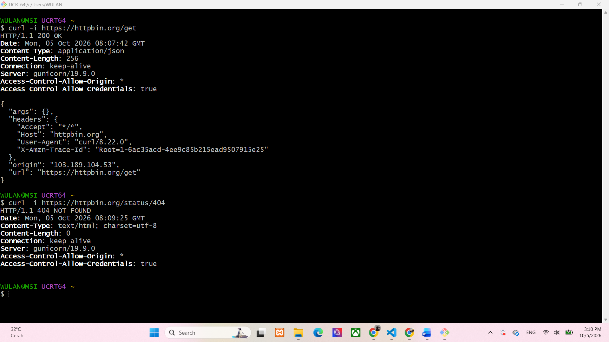
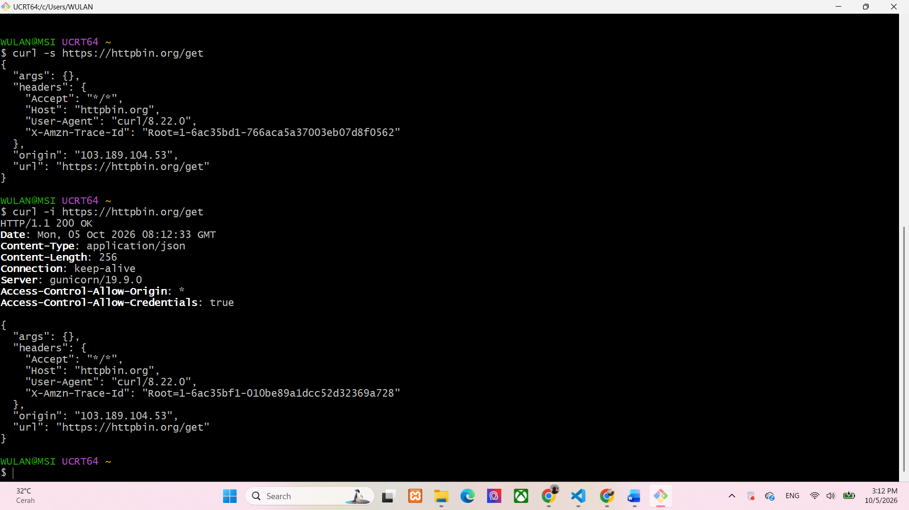

## Tugas Mandiri 4 - Pengujian API dengan Postman dan curl
### Tujuan :
Mempelajari cara melakukan pengujian API menggunakan Postman dan curl serta memahami perbedaan informasi yang ditampilkan oleh masing-masing alat.

Perintah `curl -s` hanya menampilkan response body sehingga hasilnya lebih 
sederhana dan tidak menampilkan informasi tambahan dari proses curl. Sedangkan `curl -i` menampilkan HTTP response header seperti status code,
Content-Type, dan Content-Length, kemudian menampilkan response body. Opsi `-s` dapat digunakan ketika ingin melihat isi response dengan lebih 
bersih, sedangkan `-i` digunakan ketika ingin melihat informasi header dari response server. Dengan demikian, kedua opsi tersebut digunakan 
sesuai informasi yang ingin diperiksa dari hasil request.

## Screenshot Pengujian
### POSTMAN GET

### POSTMAN POST

### CURL-I

### CURL-S

